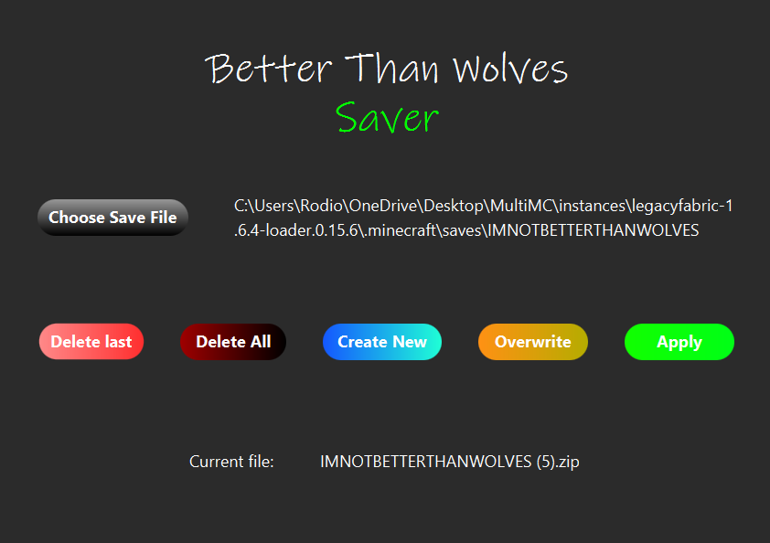

# Better Than Wolves Saver 🐺💾

> **"It's a game. It should be fun."**

A specialized backup manager for the *Better Than Wolves* (Minecraft) mod. Built to prevent permadeath trauma while keeping the challenge of Hardcore mode intact.

## 🕯️ The Problem
*Better Than Wolves* is brutal. You can survive for 40 hours, reach the Crucible stage, and then lose everything because of one mistake. The default "Hardcore" mode deletes your world instantly.

I realized that constantly manually zipping and unzipping world folders was tedious and broke my immersion. I needed a tool that let me treat death as a "Checkpoint" rather than a "Game Over."

## 🛠️ Features
* **Choose Save File:** Lets you choose a save file with your world you need to save
* **Create New:** Creates a new zip file with your save. You don't need to worry about its location!
* **Overwrite:** Overwrites your last zip file with fresher progress. No need to create a new checkpoint!
* **Apply:** Hit "Apply" to unzip the last zip file and overwrite your current save file. Go back to your last checkpoint!
* **Delete Last and Delete All:** Handles deletion for you! **Please never delete zip files manually**

## 🚀 Tech Stack
* **Language:** Java
* **UI Framework:** JavaFX
* **Styling:** Custom CSS